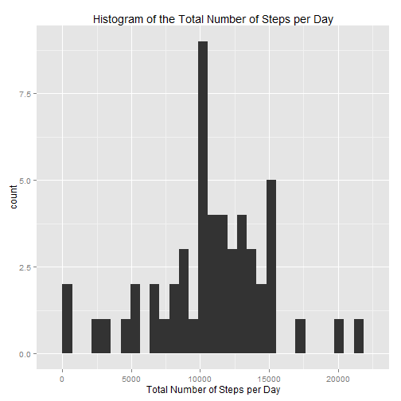
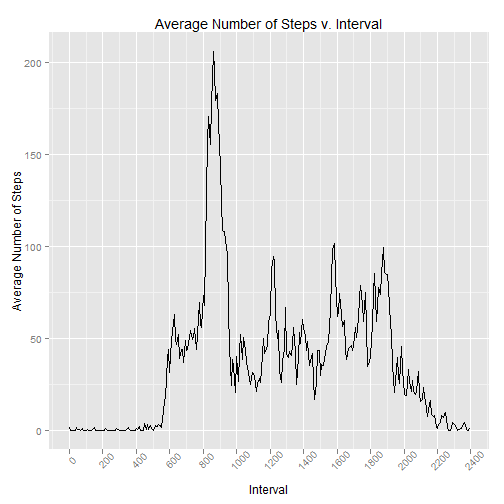
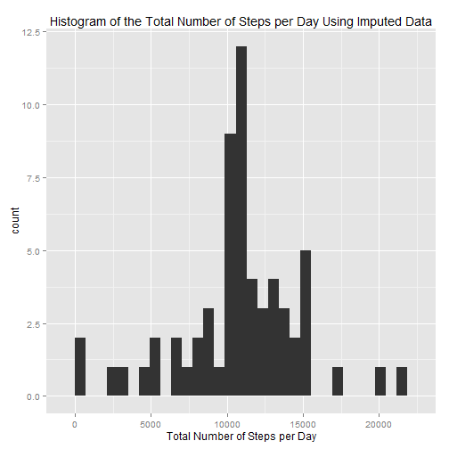
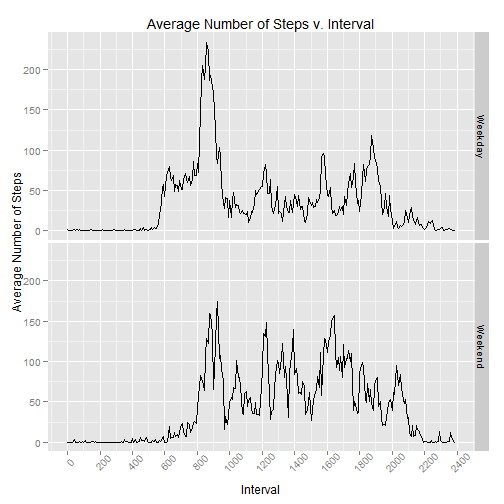

## Synopsis
This is an analysis of data collected from someone who walked a lot.
Using a personal fitness device such as a Fitbit or Fuelband or Jawbone.  The number of steps that they took was recorded at 5 minute intervals, during October and November 2012.  A zipped copy of the data can be found [here](https://d396qusza40orc.cloudfront.net/repdata%2Fdata%2Factivity.zip).  We know that there are three columns: steps, date, and interval, showing the number of steps, the day the measurement was taken, and the time interval the measurement was taken.

## Loading and preprocessing the data
First, I'm adding the libraries needed to process the data.

```r
library(plyr)
library(dplyr)
library(lubridate)
library(ggplot2)
```

Next, we bring in the file, which is unzipped and in the working directory.  I specify that there is a header.


```r
veryRawData <- read.csv("activity.csv", header=TRUE, na.strings="NA")
```

After reading in the data, we look at the summary and take a glance at a few random rows to see what it looks like.

```r
dim(veryRawData)
```

```
## [1] 17568     3
```

```r
summary(veryRawData)
```

```
##      steps               date          interval   
##  Min.   :  0.0   2012-10-01:  288   Min.   :   0  
##  1st Qu.:  0.0   2012-10-02:  288   1st Qu.: 589  
##  Median :  0.0   2012-10-03:  288   Median :1178  
##  Mean   : 37.4   2012-10-04:  288   Mean   :1178  
##  3rd Qu.: 12.0   2012-10-05:  288   3rd Qu.:1766  
##  Max.   :806.0   2012-10-06:  288   Max.   :2355  
##  NA's   :2304    (Other)   :15840
```

```r
sample_n(veryRawData, size=6, replace=FALSE)
```

```
##       steps       date interval
## 9373      0 2012-11-02     1300
## 7058      0 2012-10-25     1205
## 6699      0 2012-10-24      610
## 15360     0 2012-11-23      755
## 4518      0 2012-10-16     1625
## 14424     0 2012-11-20      155
```
From this, we can see that there are about 2300 intervals where no measurement was taken. Also, we can see that the "interval" column is basically military time; in other words, it counts by 5 to 55 and then goes back to 00.

So, to process it, we'll strip the lines with NA, make the date column a date, and because we've read ahead, create a column for the day of the week and whether it is a weekday or weekend.


```r
processedData <- veryRawData %>% filter(!is.na(steps)) %>% mutate(date = as.Date(date))%>% mutate(dayOfWeek=wday(date))
```

Also, because of the military time, we'll create a column called "graphingInterval" that will evenly space the intervals instead of putting a weird gap between 55 and 00.


```r
processedData <- mutate(processedData, graphingInterval=(((interval%/%100)*100)+((interval%%100)*5/3)))
```

The data now looks like this:


```r
head(processedData)
```

```
##   steps       date interval dayOfWeek graphingInterval
## 1     0 2012-10-02        0         3            0.000
## 2     0 2012-10-02        5         3            8.333
## 3     0 2012-10-02       10         3           16.667
## 4     0 2012-10-02       15         3           25.000
## 5     0 2012-10-02       20         3           33.333
## 6     0 2012-10-02       25         3           41.667
```

And we're able to begin answering the remainder of the questions.

## What is mean total number of steps taken per day?
To answer this, we're going to create a data frame that will consist of two columns, the date and the total number of steps taken that day.

```r
stepsPerDay <- (summarise(group_by(processedData, date), sum(steps)))

colnames(stepsPerDay) <- c("date","totalsteps")
```

Next, we'll plot a quick histogram of the number of steps for each day, so that we can visualize where the averages lie

```r
ggplot(stepsPerDay)+
  geom_histogram(data=stepsPerDay, aes(x=totalsteps))+
  ggtitle("Histogram of the Total Number of Steps per Day")+
  xlab("Total Number of Steps per Day")
```

 


Finally, we'll take the mean and median of that column to reveal the average number of steps each day

```r
mean(stepsPerDay$totalsteps)
```

```
## [1] 10766
```

```r
median(stepsPerDay$totalsteps)
```

```
## [1] 10765
```

## What is the average daily activity pattern?
To answer this question, we're going to create a data frame that finds the average number of steps for each interval. First, we'll group by the interval and create a column of the average number of steps for that interval.  Also, as above, we'll add a graphing interval. This will remove distortions from the graph. 


```r
stepsPerInterval <- data.frame(summarise(group_by(processedData, interval), mean(steps)))
colnames(stepsPerInterval) <- c("interval","averageSteps")
stepsPerInterval <- mutate(stepsPerInterval, graphingInterval=(((interval%/%100)*100)+((interval%%100)*5/3)))
```

We're now going to graph the average number of steps for each interval

```r
ggplot()+
  geom_line(data=stepsPerInterval, aes(x=graphingInterval, y=averageSteps))+
  ggtitle("Average Number of Steps v. Interval")+
  xlab("Interval")+
  ylab("Average Number of Steps")+
  scale_x_continuous(breaks=c(seq(0,2400,by=200)))+
  theme(axis.text.x=element_text(angle=45))
```

 


As can be seen, on average, there are almost no steps from midnight to 5:30 or so there's a morning peak a little before 9am, the rest of the day goes back and forth between about 25 and about 100 steps per interval until about 8pm, when the user begins to take fewer and fewer steps until midnight

We can also find which interval has the highest average.

```r
stepsPerInterval[which(stepsPerInterval$averageSteps==max(stepsPerInterval$averageSteps)),]$interval
```

```
## [1] 835
```
It looks like it is 8:35, or slightly before 9am as we can see on the graph.

## Imputing missing values
As we saw above, there were 2304 rows with a missing value. First, we'll take a quick look to see how those missing values are distributed

```r
table(is.na(veryRawData$steps),veryRawData$date)
```

```
##        
##         2012-10-01 2012-10-02 2012-10-03 2012-10-04 2012-10-05 2012-10-06
##   FALSE          0        288        288        288        288        288
##   TRUE         288          0          0          0          0          0
##        
##         2012-10-07 2012-10-08 2012-10-09 2012-10-10 2012-10-11 2012-10-12
##   FALSE        288          0        288        288        288        288
##   TRUE           0        288          0          0          0          0
##        
##         2012-10-13 2012-10-14 2012-10-15 2012-10-16 2012-10-17 2012-10-18
##   FALSE        288        288        288        288        288        288
##   TRUE           0          0          0          0          0          0
##        
##         2012-10-19 2012-10-20 2012-10-21 2012-10-22 2012-10-23 2012-10-24
##   FALSE        288        288        288        288        288        288
##   TRUE           0          0          0          0          0          0
##        
##         2012-10-25 2012-10-26 2012-10-27 2012-10-28 2012-10-29 2012-10-30
##   FALSE        288        288        288        288        288        288
##   TRUE           0          0          0          0          0          0
##        
##         2012-10-31 2012-11-01 2012-11-02 2012-11-03 2012-11-04 2012-11-05
##   FALSE        288          0        288        288          0        288
##   TRUE           0        288          0          0        288          0
##        
##         2012-11-06 2012-11-07 2012-11-08 2012-11-09 2012-11-10 2012-11-11
##   FALSE        288        288        288          0          0        288
##   TRUE           0          0          0        288        288          0
##        
##         2012-11-12 2012-11-13 2012-11-14 2012-11-15 2012-11-16 2012-11-17
##   FALSE        288        288          0        288        288        288
##   TRUE           0          0        288          0          0          0
##        
##         2012-11-18 2012-11-19 2012-11-20 2012-11-21 2012-11-22 2012-11-23
##   FALSE        288        288        288        288        288        288
##   TRUE           0          0          0          0          0          0
##        
##         2012-11-24 2012-11-25 2012-11-26 2012-11-27 2012-11-28 2012-11-29
##   FALSE        288        288        288        288        288        288
##   TRUE           0          0          0          0          0          0
##        
##         2012-11-30
##   FALSE          0
##   TRUE         288
```
The table shows that either all the values for that day are missing or none of them are. So to fill in those missing values, we'll use the average for that interval.


```r
imputedData <- veryRawData %>%
  mutate(date = as.Date(date)) %>%
  mutate(SPIIndex=(interval%/%100)*12+(interval%%100)/5+1) %>%
  mutate(intervalAverage=stepsPerInterval[SPIIndex,2])%>%
  mutate(steps=ifelse(is.na(steps),intervalAverage,steps))
```

We'll now create a "stepsPerDay" data frame of the imputed Data

```r
imputedStepsPerDay <- (summarise(group_by(imputedData, date), sum(steps)))
colnames(imputedStepsPerDay) <- c("date","totalsteps")
```

And we'll use that to plot a quick histogram of the number of steps for each day, so that we can visualize where the averages lie

```r
ggplot(imputedStepsPerDay)+
  geom_histogram(aes(x=totalsteps))+
  ggtitle("Histogram of the Total Number of Steps per Day Using Imputed Data")+
  xlab("Total Number of Steps per Day")
```

 


Again, we can calculate the mean and median of the data, this time with the imputed data included.


```r
mean(imputedStepsPerDay$totalsteps)
```

```
## [1] 10766
```

```r
median(imputedStepsPerDay$totalsteps)
```

```
## [1] 10766
```

As expected, it's almost the same as without the imputed data.  That's because the real data was pretty normal, and centered around the median.  Adding a bunch of average data isn't going to change the average and will move the median (which was already very close to the mean) closer to the mean. 

## Are there differences in activity patterns between weekdays and weekends?

To see this, we're going to create a new column called "Weekend". If the day is a weekend, it will be true. If it is false, it will be false.

```r
processedData <- mutate(processedData,
                        weekend = ifelse(dayOfWeek%in%c(1,7),"Weekend","Weekday"))
```
From there, we'll create a dataframe for the means by weekend or weekday. We'll also put in the graphing interval.

```r
newGraphData <- data.frame(summarise(group_by(processedData, weekend, interval),mean(steps)))
colnames(newGraphData)<-  c("weekend","interval","averageSteps")
newGraphData <- mutate(newGraphData, graphingInterval=(((interval%/%100)*100)+((interval%%100)*5/3)))
```

Now, we can graph the weekends against the weekdays.


```r
ggplot(newGraphData)+
  facet_grid(weekend~.)+
  geom_line(aes(x=graphingInterval, y=averageSteps))+
  ggtitle("Average Number of Steps v. Interval")+
  xlab("Interval")+
  ylab("Average Number of Steps")+
  scale_x_continuous(breaks=c(seq(0,2400,by=200)))+
  theme(axis.text.x=element_text(angle=45))
```

 

It looks like on average, there's more activity on weekday early mornings from 5:30am until about 10am.  After that, the weekends are more volatile, but still generally higher than the weekdays.  The weekends also continue to have more steps later on in the evening than the weekdays.
