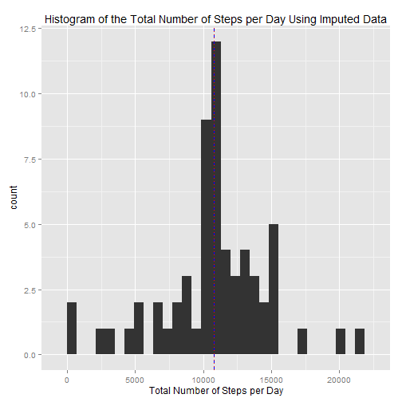

# Step Analysis over a Two Month Period

## Synopsis

An analysis of data collected from someone who walked a lot.

Using a personal fitness device such as a Fitbit or Fuelband or Jawbone, the number of steps that they took was recorded at 5 minute intervals during October and November 2012.  A zipped copy of the data can be found [here](https://d396qusza40orc.cloudfront.net/repdata%2Fdata%2Factivity.zip).  We know that there are three columns: steps, date, and interval, showing the number of steps, the day the measurement was taken, and the time interval the measurement was taken.

## Loading and preprocessing the data

First, I'm adding the libraries needed to process the data.

```r
library(plyr)
library(dplyr)
library(lubridate)
library(ggplot2)
```


###1. Load the data (i.e., read.csv())

Next, we bring in the file, which is unzipped and in the working directory. The data is in an unzipped file in the working directory. I specify that there is a header.

```r
veryRawData <- read.csv("activity.csv", header=TRUE, na.strings="NA")
```

After reading in the data, we look at the summary and take a glance at a few random rows to see what it looks like.

```r
dim(veryRawData)
```

```
## [1] 17568     3
```

```r
summary(veryRawData)
```

```
##      steps               date          interval   
##  Min.   :  0.0   2012-10-01:  288   Min.   :   0  
##  1st Qu.:  0.0   2012-10-02:  288   1st Qu.: 589  
##  Median :  0.0   2012-10-03:  288   Median :1178  
##  Mean   : 37.4   2012-10-04:  288   Mean   :1178  
##  3rd Qu.: 12.0   2012-10-05:  288   3rd Qu.:1766  
##  Max.   :806.0   2012-10-06:  288   Max.   :2355  
##  NA's   :2304    (Other)   :15840
```

```r
sample_n(veryRawData, size=6, replace=FALSE)
```

```
##       steps       date interval
## 1935    523 2012-10-07     1710
## 10464   372 2012-11-06      755
## 15842     0 2012-11-25        5
## 1283      0 2012-10-05     1050
## 5209      0 2012-10-19      200
## 12443     0 2012-11-13      450
```
From this, we can see that there are about 2300 intervals where no measurement was taken. Also, we can see that the "interval" column is basically military time; in other words, it counts by 5 to 55 and then goes back to 00.

### 2. Process/transform the data (if necessary) into a format suitable for your analysis

To process the data, we strip the lines with NA, make the date column a date, and because we've read ahead, create a column for the day of the week and whether it is a weekday or weekend.


```r
processedData <- veryRawData %>% filter(!is.na(steps)) %>% mutate(date = as.Date(date))%>% mutate(dayOfWeek=wday(date))
```

Also, because of the military time, we create a column called "graphingInterval" that will evenly space the intervals instead of putting a weird gap between 55 and 00.


```r
processedData <- mutate(processedData, graphingInterval=(((interval%/%100)*100)+((interval%%100)*5/3)))
```

The data now looks like this:


```r
head(processedData)
```

```
##   steps       date interval dayOfWeek graphingInterval
## 1     0 2012-10-02        0         3            0.000
## 2     0 2012-10-02        5         3            8.333
## 3     0 2012-10-02       10         3           16.667
## 4     0 2012-10-02       15         3           25.000
## 5     0 2012-10-02       20         3           33.333
## 6     0 2012-10-02       25         3           41.667
```

And we're able to begin answering the remainder of the questions.

## What is mean total number of steps taken per day?

### 1. Calculate the total number of steps taken per day

To answer this, we're going to create a data frame that will consist of two columns, the date and the total number of steps taken that day.

```r
stepsPerDay <- (summarise(group_by(processedData, date), sum(steps)))
colnames(stepsPerDay) <- c("date","totalsteps")
sample_n(stepsPerDay,5)
```

```
## Source: local data frame [5 x 2]
## 
##         date totalsteps
## 1 2012-10-24       8355
## 2 2012-10-14      15098
## 3 2012-11-20       4472
## 4 2012-11-02      10600
## 5 2012-11-22      20427
```
As you can see, the number of steps each day has been calculated.

### 2. Make a histogram of the total number of steps taken each day

Next, we plot a quick histogram of the number of steps for each day, so that we can visualize where the averages lie (we also put a blue line at the mean and a red line at the median to make visualization even easier.)

```r
ggplot(stepsPerDay)+
  geom_histogram(aes(x=totalsteps))+
  ggtitle("Histogram of the Total Number of Steps per Day")+
  xlab("Total Number of Steps per Day")+
  geom_vline(xintercept=mean(stepsPerDay$totalsteps),color="#0000FF",linetype="dashed")+
  geom_vline(xintercept=median(stepsPerDay$totalsteps),color="#FF0000", linetype="dotted")
```

 


### 3. Calculate and report the mean and median of the total number of steps taken per day

Finally, we take the mean and median of that column to reveal the average number of steps each day

```r
mean(stepsPerDay$totalsteps)
```

```
## [1] 10766
```

```r
median(stepsPerDay$totalsteps)
```

```
## [1] 10765
```

## What is the average daily activity pattern?

### 1. Make a time series plot (i.e. type = "l") of the 5-minute interval (x-axis) and the average number of steps taken, averaged across all days (y-axis)

To answer this question, we're going to create a data frame that finds the average number of steps for each interval. First, we group by the interval and create a column of the average number of steps for that interval.  Also, as above, we add a graphing interval. This will remove distortions from the graph. 


```r
stepsPerInterval <- data.frame(summarise(group_by(processedData, interval), mean(steps)))
colnames(stepsPerInterval) <- c("interval","averageSteps")
stepsPerInterval <- mutate(stepsPerInterval, graphingInterval=(((interval%/%100)*100)+((interval%%100)*5/3)))
```

We're now going to graph the average number of steps for each interval

```r
ggplot()+
  geom_line(data=stepsPerInterval, aes(x=graphingInterval, y=averageSteps))+
  ggtitle("Average Number of Steps v. Interval")+
  xlab("Interval")+
  ylab("Average Number of Steps")+
  scale_x_continuous(breaks=c(seq(0,2400,by=200)))+
  theme(axis.text.x=element_text(angle=45))
```

 


As can be seen, on average, there are almost no steps from midnight to 5:30 or so there's a morning peak a little before 9am, the rest of the day goes back and forth between about 25 and about 100 steps per interval until about 8pm, when the user begins to take fewer and fewer steps until midnight

### 2. Which 5-minute interval, on average across all the days in the dataset, contains the maximum number of steps?

We can also find which interval has the highest average.

```r
stepsPerInterval[which(stepsPerInterval$averageSteps==max(stepsPerInterval$averageSteps)),]$interval
```

```
## [1] 835
```
It looks like it is 8:35, or slightly before 9am as we can see on the graph.

## Imputing missing values

### 1. Calculate and report the total number of missing values in the dataset (i.e. the total number of rows with NAs)

We saw this earlier.  But we can look at the summary of the original data again:

```r
summary(veryRawData)
```

```
##      steps               date          interval   
##  Min.   :  0.0   2012-10-01:  288   Min.   :   0  
##  1st Qu.:  0.0   2012-10-02:  288   1st Qu.: 589  
##  Median :  0.0   2012-10-03:  288   Median :1178  
##  Mean   : 37.4   2012-10-04:  288   Mean   :1178  
##  3rd Qu.: 12.0   2012-10-05:  288   3rd Qu.:1766  
##  Max.   :806.0   2012-10-06:  288   Max.   :2355  
##  NA's   :2304    (Other)   :15840
```
There are 2304 rows with a missing value.

### 2. Devise a strategy for filling in all of the missing values in the dataset. The strategy does not need to be sophisticated. For example, you could use the mean/median for that day, or the mean for that 5-minute interval, etc.


First, we take a quick look to see how those missing values are distributed

```r
table(is.na(veryRawData$steps),veryRawData$date)
```

```
##        
##         2012-10-01 2012-10-02 2012-10-03 2012-10-04 2012-10-05 2012-10-06
##   FALSE          0        288        288        288        288        288
##   TRUE         288          0          0          0          0          0
##        
##         2012-10-07 2012-10-08 2012-10-09 2012-10-10 2012-10-11 2012-10-12
##   FALSE        288          0        288        288        288        288
##   TRUE           0        288          0          0          0          0
##        
##         2012-10-13 2012-10-14 2012-10-15 2012-10-16 2012-10-17 2012-10-18
##   FALSE        288        288        288        288        288        288
##   TRUE           0          0          0          0          0          0
##        
##         2012-10-19 2012-10-20 2012-10-21 2012-10-22 2012-10-23 2012-10-24
##   FALSE        288        288        288        288        288        288
##   TRUE           0          0          0          0          0          0
##        
##         2012-10-25 2012-10-26 2012-10-27 2012-10-28 2012-10-29 2012-10-30
##   FALSE        288        288        288        288        288        288
##   TRUE           0          0          0          0          0          0
##        
##         2012-10-31 2012-11-01 2012-11-02 2012-11-03 2012-11-04 2012-11-05
##   FALSE        288          0        288        288          0        288
##   TRUE           0        288          0          0        288          0
##        
##         2012-11-06 2012-11-07 2012-11-08 2012-11-09 2012-11-10 2012-11-11
##   FALSE        288        288        288          0          0        288
##   TRUE           0          0          0        288        288          0
##        
##         2012-11-12 2012-11-13 2012-11-14 2012-11-15 2012-11-16 2012-11-17
##   FALSE        288        288          0        288        288        288
##   TRUE           0          0        288          0          0          0
##        
##         2012-11-18 2012-11-19 2012-11-20 2012-11-21 2012-11-22 2012-11-23
##   FALSE        288        288        288        288        288        288
##   TRUE           0          0          0          0          0          0
##        
##         2012-11-24 2012-11-25 2012-11-26 2012-11-27 2012-11-28 2012-11-29
##   FALSE        288        288        288        288        288        288
##   TRUE           0          0          0          0          0          0
##        
##         2012-11-30
##   FALSE          0
##   TRUE         288
```
The table shows that either all the values for that day are missing or none of them are. So to fill in those missing values, we use the average for that interval.

### 3. Create a new dataset that is equal to the original dataset but with the missing data filled in.


```r
imputedData <- veryRawData %>% mutate(date=as.Date(date))
imputedData <- merge(x=imputedData, y= stepsPerInterval, by.x="interval", by.y="interval", all.x=TRUE)
imputedData <- imputedData %>%
  mutate(steps = ifelse(is.na(steps),averageSteps,steps)) %>%
  select(-averageSteps) %>%
  arrange(date,interval)
summary(imputedData)
```

```
##     interval        steps            date            graphingInterval
##  Min.   :   0   Min.   :  0.0   Min.   :2012-10-01   Min.   :   0    
##  1st Qu.: 589   1st Qu.:  0.0   1st Qu.:2012-10-16   1st Qu.: 598    
##  Median :1178   Median :  0.0   Median :2012-10-31   Median :1196    
##  Mean   :1178   Mean   : 37.4   Mean   :2012-10-31   Mean   :1196    
##  3rd Qu.:1766   3rd Qu.: 27.0   3rd Qu.:2012-11-15   3rd Qu.:1794    
##  Max.   :2355   Max.   :806.0   Max.   :2012-11-30   Max.   :2392
```
In the summary, we can see that this new imputedData dataframe has all intervals with missing data filled in as there are no NAs in the "interval" column.

### 4. Make a histogram of the total number of steps taken each day and Calculate and report the mean and median total number of steps taken per day. Do these values differ from the estimates from the first part of the assignment? What is the impact of imputing missing data on the estimates of the total daily number of steps?

We now create a "stepsPerDay" data frame of the imputed Data

```r
imputedStepsPerDay <- (summarise(group_by(imputedData, date), sum(steps)))
colnames(imputedStepsPerDay) <- c("date","totalsteps")
```

And we use that to plot a quick histogram of the number of steps for each day, so that we can visualize where the averages lie, again putting vertical lines at the mean and median.

```r
ggplot(imputedStepsPerDay)+
  geom_histogram(aes(x=totalsteps))+
  ggtitle("Histogram of the Total Number of Steps per Day Using Imputed Data")+
  xlab("Total Number of Steps per Day")+
  geom_vline(xintercept=mean(imputedStepsPerDay$totalsteps),color="#0000FF",linetype="dashed")+
  geom_vline(xintercept=median(imputedStepsPerDay$totalsteps),color="#FF0000", linetype="dotted")
```

 


Again, we can calculate the mean and median of the data, this time with the imputed data included.


```r
mean(imputedStepsPerDay$totalsteps)
```

```
## [1] 10766
```

```r
median(imputedStepsPerDay$totalsteps)
```

```
## [1] 10766
```

As expected, they're almost the same as without the imputed data.  That's because the real data was pretty normal, and centered around the median.  Adding a bunch of average data isn't going to change the average and will move the median (which was already very close to the mean) closer to the mean. 

## Are there differences in activity patterns between weekdays and weekends?

### 1. Create a new factor variable in the dataset with two levels - "weekday" and "weekend" indicating whether a given date is a weekday or weekend day.

Because the imputed data did not take day of the week into account, we're going back to the data frame that dropped the unavailable data to answer this question. Using that data frame, we're going to create a new column called "Weekend". If the day is a weekend, "Weekend". If it is a weekday, it will be "Weekday".


```r
processedData <- mutate(processedData,
                        weekend = as.factor(ifelse(dayOfWeek%in%c(1,7),"Weekend","Weekday")))
```

### 2. Make a panel plot containing a time series plot (i.e. type = "l") of the 5-minute interval (x-axis) and the average number of steps taken, averaged across all weekday days or weekend days (y-axis). 

From there, we create a dataframe for the means by weekend or weekday. we also put in the graphing interval.

```r
typeOfDayData <- data.frame(summarise(group_by(processedData, weekend, interval),mean(steps)))
colnames(typeOfDayData)<-  c("weekend","interval","averageSteps")
typeOfDayData <- mutate(typeOfDayData, graphingInterval=(((interval%/%100)*100)+((interval%%100)*5/3)))
```

Now, we can graph the weekends against the weekdays.


```r
ggplot(typeOfDayData)+
  facet_grid(weekend~.)+
  geom_line(aes(x=graphingInterval, y=averageSteps))+
  ggtitle("Average Number of Steps v. Interval")+
  xlab("Interval")+
  ylab("Average Number of Steps")+
  scale_x_continuous(breaks=c(seq(0,2400,by=200)))+
  theme(axis.text.x=element_text(angle=45))
```

 

It looks like on average, there's more activity on weekday early mornings from 5:30am until about 10am.  After that, the weekends are more volatile, but still generally higher than the weekdays.  The weekends also continue to have more steps later on in the evening than the weekdays.
